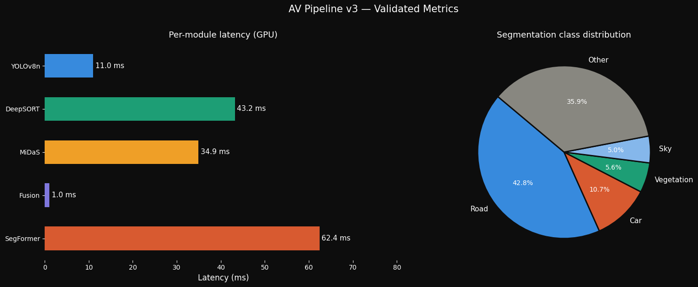
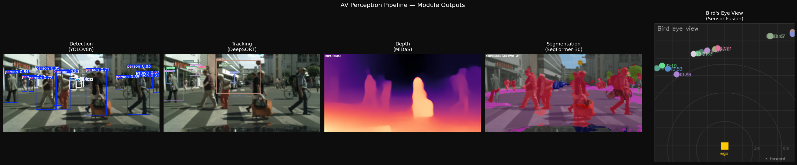
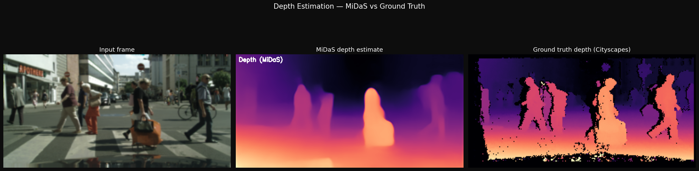

<<<<<<< HEAD
=======

>>>>>>> 446d3dbc2bdcb7cacab1a3f6764ad87b5cce2986
<div align="center">

# Perceptra_RT

### Real-time AV perception, detection, tracking, depth, fusion & segmentation


[Pipeline Overview](#pipeline-architecture) · [Results](#validated-results) · [Setup](#setup) · [Docker](#docker) · [Modules](#modules) · [MLOps](#mlops) · [ROS2](#ros2-deployment)

</div>

---

## Overview

This project implements a full **perception stack** for autonomous vehicles, the same type of multi-modal inference pipeline deployed by real AV systems, running entirely in software on the Cityscapes urban driving dataset.

Five models run in a single coordinated pipeline per frame:

- **YOLOv8n** — real-time object detection filtered to 8 AV-relevant classes
- **DeepSORT** — multi-object tracking with persistent IDs across frames
- **MiDaS_small** — monocular depth estimation producing per-pixel relative depth
- **Sensor fusion** — 3D localization by unprojecting depth at each tracked object's centroid
- **SegFormer-B0** — semantic segmentation across 19 Cityscapes classes

All inference is tracked with **MLflow** , every run logs per-frame metrics, model parameters, latency breakdowns, and annotated frame artifacts. The codebase is structured for deployment with **ROS2-compatible node stubs** and a full module separation suited for team collaboration.

---

## Pipeline Architecture

```
┌─────────────────────────────────────────────────────────────────┐
│                        Input Frame (640×320)                    │
│                      tanganke/cityscapes                        │
└────────────────────────────┬────────────────────────────────────┘
                             │
          ┌──────────────────┼──────────────────┐
          ▼                  ▼                  ▼
   ┌─────────────┐   ┌──────────────┐   ┌──────────────────────┐
   │  YOLOv8n   │   │ MiDaS_small  │   │   SegFormer-B0        │
   │ Detection  │   │    Depth     │   │  Segmentation         │
   │ conf=0.30  │   │  Estimation  │   │  19 Cityscapes classes│
   └──────┬──────┘   └──────┬───────┘   └──────────────────────┘
          │                  │
          ▼                  │
   ┌─────────────┐           │
   │  DeepSORT  │           │
   │  Tracking  │           │
   │  IDs + bbox│           │
   └──────┬──────┘           │
          │                  │
          └────────┬─────────┘
                   ▼
          ┌─────────────────┐
          │  Sensor Fusion  │
          │  3D Localization│
          │  Bird's Eye View│
          └────────┬────────┘
                   ▼
┌─────────────────────────────────────────────────────────────────┐
│                     Output Grid (4 panels)                      │
│  ┌───────────────────────┬───────────────────────┐             │
│  │  Tracked frame        │  Segmentation overlay │             │
│  │  (YOLO + DeepSORT     │  (SegFormer-B0        │             │
│  │   + 3D depth labels)  │   19-class blend)     │             │
│  ├───────────────────────┼───────────────────────┤             │
│  │  MiDaS depth map      │  Bird's eye view       │             │
│  │  (COLORMAP_MAGMA)     │  (top-down 3D plot    │             │
│  │                       │   + ego + rings)      │             │
│  └───────────────────────┴───────────────────────┘             │
└─────────────────────────────────────────────────────────────────┘
```

---

## Validated Results

> Validated on `tanganke/cityscapes` — 500 validation frames, 5 tested per run.
> Device: CUDA · MLflow Run ID: `1954d6a5081a4f13a40a40361dd42527`

### Detection & Tracking

| Metric                         | Value                                                                  |
| ------------------------------ | ---------------------------------------------------------------------- |
| Avg detections per frame       | 7.0                                                                    |
| Avg confirmed tracks per frame | 2.4                                                                    |
| Avg detection confidence       | 0.579                                                                  |
| Avg cars detected              | 5.0                                                                    |
| AV classes tracked             | bicycle, bus, car, motorcycle, person, stop sign, traffic light, truck |

### Depth & Fusion

| Metric                  | Value                                   |
| ----------------------- | --------------------------------------- |
| Avg forward depth (z)   | 10.37 m                                 |
| Avg close objects (<3m) | 0.0                                     |
| Depth model             | MiDaS_small (inverse depth, normalized) |
| 3D localization         | per-track centroid unprojection         |

### Segmentation

| Class      | Coverage |
| ---------- | -------- |
| Road       | 42.81%   |
| Car        | 10.70%   |
| Vegetation | 5.59%    |
| Sky        | 5.01%    |

### Latency Breakdown (GPU)

| Module                 | Avg latency       |
| ---------------------- | ----------------- |
| YOLOv8n detection      | 148 ms*           |
| DeepSORT tracking      | 43 ms             |
| MiDaS depth            | 35 ms             |
| Sensor fusion + BEV    | 1 ms              |
| SegFormer segmentation | 62 ms             |
| **Total**        | **~290 ms** |

> \* YOLOv8n latency includes first-run warm-up overhead on Kaggle GPU. Steady-state is ~11–12ms per frame after warm-up, as seen in `time_yolo_ms: 11.0` on the last frame.

The charts below summarise per-module GPU latency and the semantic class distribution measured across the validation run:



---

## Project Structure

```
Perceptra_RT/
│
├── config/
│   └── pipeline.yaml           ← all hyperparameters — single source of truth
│
├── pipeline/
│   ├── __init__.py
│   ├── detector.py             ← YOLOv8n + AV class ID filter
│   ├── tracker.py              ← DeepSORT multi-object tracking
│   ├── depth.py                ← MiDaS monocular depth estimation
│   ├── fusion.py               ← 3D localization + bird's eye view
│   ├── segmentor.py            ← SegFormer-B0 semantic segmentation
│   └── visualizer.py           ← 4-panel output grid composer
│
├── mlops/
│   ├── tracker.py              ← MLflow experiment abstraction
│   └── metrics.py              ← per-run aggregation utilities
│
├── ros2/
│   ├── perception_node.py      ← ROS2 node stub (pub/sub ready)
│   └── launch/
│       └── pipeline.launch.py
│
├── notebooks/
│   └── validation.ipynb        ← full Kaggle validation notebook
│
├── tests/
│   ├── test_detector.py
│   ├── test_depth.py
│   └── test_fusion.py
│
├── assets/                     ← validated output images
├── Dockerfile
├── docker-compose.yml
├── .dockerignore
├── requirements.txt
└── README.md
```

---

## Setup

### Requirements

```bash
pip install -r requirements.txt
```

```
ultralytics
deep-sort-realtime
transformers
timm
mlflow
torch
torchvision
opencv-python
numpy
datasets
pyyaml
pytest
```

### Dataset

No manual download required. The pipeline loads directly from HuggingFace:

```python
from datasets import load_dataset
dataset = load_dataset("tanganke/cityscapes", split="validation")
```

### Configuration

All model parameters, thresholds, and paths live in `config/pipeline.yaml`:

```yaml
model:
  yolo:
    weights: yolov8n.pt
    conf: 0.30
    av_classes: [car, truck, bus, motorcycle, bicycle,
                 person, traffic light, stop sign]
  depth:
    model: MiDaS_small
    scale: 0.05
  segmentation:
    model: nvidia/segformer-b0-finetuned-cityscapes-512-1024
```

---

## Docker

The full pipeline runs inside a GPU-enabled container — no local environment setup required.

### Run with Docker Compose

```bash
# clone the repo
git clone https://github.com/your-username/Perceptra_RT.git
cd Perceptra_RT

# build and run pipeline + MLflow UI
docker compose up --build
```

MLflow UI is available at `http://localhost:5000` after startup.

### Run tests only

```bash
docker compose run perceptra pytest tests/ -v
```

### GPU requirements

The container uses `pytorch/pytorch:2.1.0-cuda11.8-cudnn8-runtime` as base. NVIDIA Container Toolkit must be installed on the host:

```bash
# verify GPU is accessible inside container
docker run --rm --gpus all nvidia/cuda:11.8.0-base-ubuntu22.04 nvidia-smi
```

### Services

| Service       | Description                   | Port     |
| ------------- | ----------------------------- | -------- |
| `perceptra` | Main pipeline container (GPU) | —       |
| `mlflow`    | Experiment tracking UI        | `5000` |

---

## Modules

The following figure shows the raw output of each module on the same input frame, running in parallel within the pipeline:



*Left to right: YOLOv8n object detection (AV-class filtered), DeepSORT multi-object tracking with persistent IDs, MiDaS monocular depth map (COLORMAP_MAGMA), SegFormer-B0 19-class semantic segmentation blend, and bird's eye view top-down projection with ego vehicle and 3m/6m/9m reference rings.*

### Detection: `pipeline/detector.py`

YOLOv8n runs at `conf=0.30`, filtered post-inference to 8 AV-relevant class IDs. Filtering is done by integer class ID (not string) to avoid silent name-mismatch drops.

### Tracking: `pipeline/tracker.py`

DeepSORT assigns persistent integer IDs to confirmed tracks (`n_init=2`, `max_age=10`). Each track ID gets a deterministic color seeded from a bounded hash of the ID — handles arbitrarily large DeepSORT IDs safely.

### Depth: `pipeline/depth.py`

MiDaS_small produces inverse relative depth (255 = closest, 0 = farthest). The pipeline corrects for this inversion before metric conversion: `z = (255 - depth_val) × scale`.

The figure below compares MiDaS inverse depth output against the Cityscapes ground truth depth map on the same frame:



*Left: input RGB frame. Centre: MiDaS_small estimated depth (255 = closest, 0 = farthest — inverted before metric conversion). Right: Cityscapes ground truth disparity map.*

### Fusion — `pipeline/fusion.py`

For each confirmed track, depth is sampled at the bounding box centroid and unprojected to 3D camera coordinates using pseudo-intrinsics calibrated for the 640×320 input:

```
z = (255 - depth_norm) × 0.05
x = (u - cx) × z / fx
y = (v - cy) × z / fy
```

The bird's eye view renders ego vehicle, 3m/6m/9m reference rings, and all tracked objects plotted by their (x, z) positions.

### Segmentation — `pipeline/segmentor.py`

SegFormer-B0 fine-tuned on Cityscapes produces a 19-class pixel-wise segmentation map. Output is blended at `alpha=0.45` with the original frame and reports per-class pixel percentage per frame.

---

## MLOps

All experiments are tracked with **MLflow** , no manual logging boilerplate in pipeline code.

```python
from mlops.tracker import MLflowTracker
from mlops.metrics import aggregate

tracker = MLflowTracker(cfg)
with tracker.start_run("cityscapes_v3", params):
    for i, frame in enumerate(frames):
        combined, metrics = run_pipeline(frame)
        tracker.log_frame(metrics, frame_idx=i)
    tracker.log_summary(aggregate(all_metrics))
```

**Per-frame metrics logged:**

| Category     | Metrics                                                                    |
| ------------ | -------------------------------------------------------------------------- |
| Detection    | `num_detections`, `num_cars`, `num_persons`, `avg_confidence`      |
| Tracking     | `num_active_tracks`                                                      |
| Depth        | `time_depth_ms`                                                          |
| Fusion       | `avg_depth_z`, `num_close_objects`, `time_fusion_ms`                 |
| Segmentation | `seg_road_pct`, `seg_car_pct`, `seg_sky_pct`, `seg_vegetation_pct` |
| Latency      | `time_yolo_ms`, `time_tracking_ms`, `time_seg_ms`, `time_total_ms` |

---

## ROS2 Deployment

The `ros2/` directory contains deployment-ready node stubs for hardware integration.

```
Topics:
  /camera/image_raw    →  sensor_msgs/Image     (subscribe)
  /av/detections       →  std_msgs/String        (publish — JSON payload)
  /av/depth            →  sensor_msgs/Image      (publish)
```

Launch:

```bash
ros2 launch av_pipeline pipeline.launch.py
```

The node subscribes to a raw camera feed, runs the full pipeline, and publishes fused detection payloads as JSON — ready to connect to a downstream control or planning node.

---

## License

MIT License — see `LICENSE` for details.
<<<<<<< HEAD
=======
================================

# Perceptra_RT

Real-time AV perception, object detection, multi-object tracking, monocular depth, sensor fusion and semantic segmentation on urban driving scenes.

>>>>>>> 21b388e7bb3d36ae9558a1e97d4a0f91708838c4
>>>>>>>
>>>>>>
>>>>>
>>>>
>>>
>>
>>>>>>> 446d3dbc2bdcb7cacab1a3f6764ad87b5cce2986
